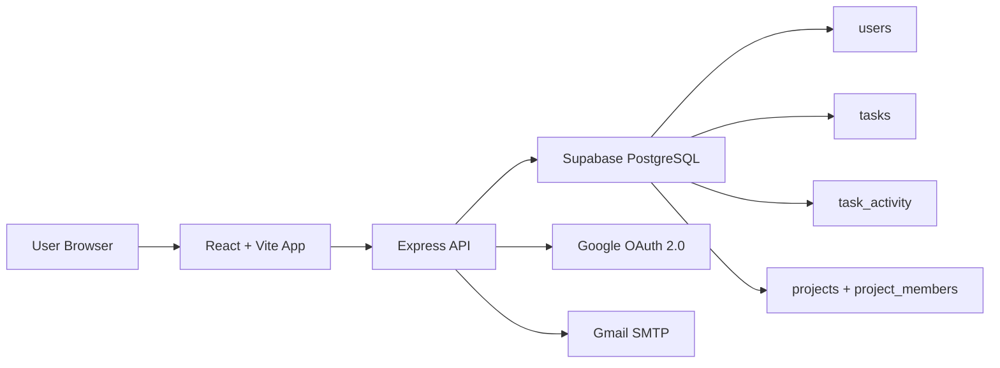

# TaskForge AI

TaskForge AI is a production-oriented task management platform built with React, Express, Supabase PostgreSQL, Google OAuth 2.0, and Gmail SMTP.

## Architecture



## What Changed

- MongoDB and Mongoose were removed from the active app flow.
- Authentication now uses Google OAuth 2.0 and JWT session tokens.
- Task data, project membership, notifications, chat, comments, and files now run on Supabase Postgres tables.
- Task activity is tracked in `task_activity`.
- Gmail SMTP is used for assignment and completion notifications.

## Repository Layout

```text
taskforge-ai/
  backend/
    config/
    controllers/
    middleware/
    services/
    supabase/migrations/
    routes/
    server.js
  frontend/
    src/
    vercel.json
  render.yaml
  .env.example
```

## Installation

### 1. Install dependencies

```bash
cd backend
npm install

cd ../frontend
npm install
```

### 2. Configure environment variables

Copy `.env.example` to your local `.env` files and fill in the values.

### 3. Apply Supabase schema

Run the SQL in `backend/supabase/migrations/001_init.sql` in the Supabase SQL editor.

### 4. Start locally

```bash
cd backend
npm run dev

cd ../frontend
npm run dev
```

## Environment Variables

### Backend

- `PORT`
- `NODE_ENV`
- `FRONTEND_URL`
- `JWT_SECRET`
- `JWT_EXPIRE`
- `SUPABASE_URL`
- `SUPABASE_SERVICE_ROLE_KEY`
- `GOOGLE_CLIENT_ID`
- `GOOGLE_CLIENT_SECRET`
- `EMAIL_USER`
- `EMAIL_PASS`

### Frontend

- `VITE_API_URL`
- `VITE_GOOGLE_CLIENT_ID`

## Database Schema

### `users`

- `id`
- `google_id`
- `name`
- `email`
- `avatar_url`
- `role`
- `is_active`
- `created_at`
- `updated_at`

### `projects`

- `id`
- `title`
- `description`
- `created_by`
- `progress`
- `status`
- `start_date`
- `end_date`
- `created_at`
- `updated_at`

### `project_members`

- `id`
- `project_id`
- `user_id`
- `role`
- `added_at`
- `added_by`

### `tasks`

- `id`
- `title`
- `description`
- `creator_id`
- `assignee_id`
- `project_id`
- `priority`
- `status`
- `approval_status`
- `approval_note`
- `approved_by`
- `due_date`
- `is_subtask`
- `parent_task_id`
- `completed_at`
- `created_at`
- `updated_at`

### `task_activity`

- `id`
- `task_id`
- `user_id`
- `action`
- `previous_data`
- `new_data`
- `created_at`

## API Overview

### Auth

- `POST /api/auth/google`
- `GET /api/auth/me`
- `GET /api/auth/users`

### Projects

- `GET /api/projects`
- `POST /api/projects`
- `GET /api/projects/:id`
- `PUT /api/projects/:id`
- `DELETE /api/projects/:id`

### Tasks

- `GET /api/tasks`
- `POST /api/tasks`
- `GET /api/tasks/:id`
- `PUT /api/tasks/:id`
- `PATCH /api/tasks/:id/status`
- `DELETE /api/tasks/:id`
- `GET /api/tasks/ai/prediction/:projectId`

### Activity

- `GET /api/activity`
- `GET /api/activity/project/:projectId`
- `GET /api/activity/stats`

### Notifications

- `GET /api/notifications`
- `PUT /api/notifications/:id/read`
- `PUT /api/notifications/read-all`

### Chat and Files

- `GET /api/chat/:projectId/messages`
- `POST /api/chat/:projectId/messages`
- `POST /api/files/upload`

## Deployment

### Supabase

1. Create a Supabase project.
2. Run `backend/supabase/migrations/001_init.sql`.
3. Copy `SUPABASE_URL` and `SUPABASE_SERVICE_ROLE_KEY` into your backend env.

### Render backend

1. Connect the repo to Render.
2. Use `render.yaml` or a web service pointing at `backend`.
3. Add the backend env vars from `.env.example`.
4. Deploy.

### Vercel frontend

1. Create a new Vercel project from the `frontend` folder.
2. Set `VITE_API_URL` and `VITE_GOOGLE_CLIENT_ID`.
3. Deploy.

## Seed Data

Run the Supabase seed helper:

```bash
cd backend
npm run seed
```

## Notes

- Existing React routes were preserved.
- The UI now uses Google sign-in and the backend still issues JWTs for API protection.
- Legacy MongoDB/Mongoose files were removed from the active backend.
